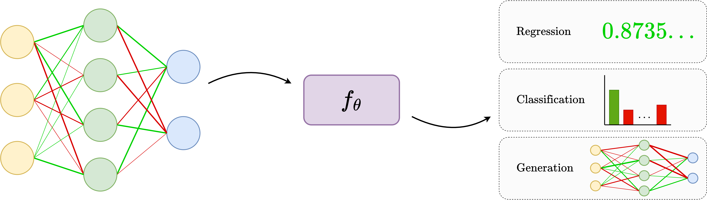

# Awesome Weight Space Learning

Weight-space learning is a rapidly-growing area within machine learning, centered on learning functions of neural network weights. This repository is a collection of weight-space learning papers. 

It is not exhaustive and will likely never be, but feel free to open a PR if you want to see a paper listed (self-promotion is welcome 🙃). 

**Table of Contents**
- [Awesome Weight Space Learning](#awesome-weight-space-learning)
  - [Papers](#papers)
    - [Architectures](#architectures)
    - [Weight-Space Generative Models](#weight-space-generative-models)
    - [Applications](#applications)
    - [Datasets](#datasets)
    - [Other](#other)
  - [PhD/MSc Theses](#phdmsc-theses)
  - [Blogs, Talks, etc.](#blogs-talks-etc)

---

## Papers

### Architectures 

* Schürholt et al - [Towards Scalable and Versatile Weight Space Learning](http://arxiv.org/abs/2406.09997) (2024)
* Kalogeropoulos et al - [Scale Equivariant Graph Metanetworks](http://arxiv.org/abs/2406.10685) (2024)
* Kofinas et al - [Graph Neural Networks for Learning Equivariant Representations of Neural Networks](https://doi.org/10.48550/arXiv.2403.12143) (2024)
* Zhou et al - [Universal Neural Functionals](https://doi.org/10.48550/arXiv.2402.05232) (2024)
* Zhou et al - [Permutation Equivariant Neural Functionals](https://doi.org/10.48550/arXiv.2302.14040) (2023)
* Zhou et al - [Neural Functional Transformers](https://papers.nips.cc/paper_files/paper/2023/hash/6e2290d3b6168f9747f38786e40c21f2-Abstract-Conference.html) (2023)
* Lim et al - [Graph Metanetworks for Processing Diverse Neural Architectures](https://doi.org/10.48550/arXiv.2312.04501) (2023)
* Navon et al - [Equivariant Architectures for Learning in Deep Weight Spaces](https://doi.org/10.48550/arXiv.2301.12780) (2023)
* Unterthiner et al - [Predicting Neural Network Accuracy from Weights](https://doi.org/10.48550/arXiv.2002.11448) (2021)

### Weight-Space Generative Models

* Erkoç et al - [HyperDiffusion: Generating Implicit Neural Fields with Weight-Space Diffusion](https://openaccess.thecvf.com/content/ICCV2023/html/Erkoc_HyperDiffusion_Generating_Implicit_Neural_Fields_with_Weight-Space_Diffusion_ICCV_2023_paper.html) (2023)
* Schürholt et al - [Hyper-Representations as Generative Models: Sampling Unseen Neural Network Weights](https://proceedings.neurips.cc/paper_files/paper/2022/hash/b2c4b7d34b3d96b9dc12f7bce424b7ae-Abstract-Conference.html) (2022)
* Peebles et al - [Learning to Learn with Generative Models of Neural Network Checkpoints](https://doi.org/10.48550/arXiv.2209.12892) (2022)

### Applications

* Schürholt et al - [Self-Supervised Representation Learning on Neural Network Weights for Model Characteristic Prediction](https://proceedings.neurips.cc/paper_files/paper/2021/hash/89562dccfeb1d0394b9ae7e09544dc70-Abstract.html) (2021)

### Datasets

* Schürholt et al - [Model Zoos: A Dataset of Diverse Populations of Neural Network Models](https://proceedings.neurips.cc/paper/2022/hash/f3b7e5d3eb074cde5b76e26bc0fb5776-Abstract-Conference.html) (2022)

### Other

* Kahana et al - [Deep Linear Probe Generators for Weight Space Learning](https://doi.org/10.48550/arXiv.2410.10811) (2024)
* Navon et al - [Equivariant Deep Weight Space Alignment](https://doi.org/10.48550/arXiv.2310.13397) (2024)
* Shamsian et al - [Improved Generalization of Weight Space Networks via Augmentations](https://doi.org/10.48550/arXiv.2402.04081) (2024)

## PhD/MSc Theses

* Erdogan E. - [Geometric Flow Models over Neural Network Weights](https://github.com/ege-erdogan/msc-thesis) (2025)
* Schürholt K. - [Hyper-Representations: Learning from Populations of Neural Networks](https://arxiv.org/abs/2410.05107) (2024)

## Blogs, Talks, etc.

